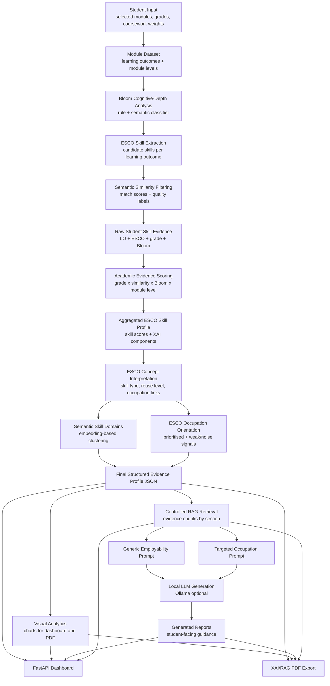
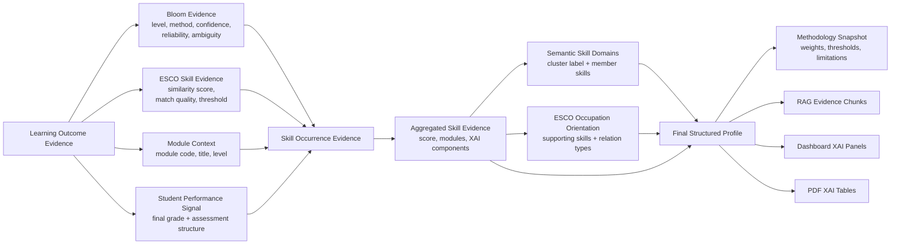
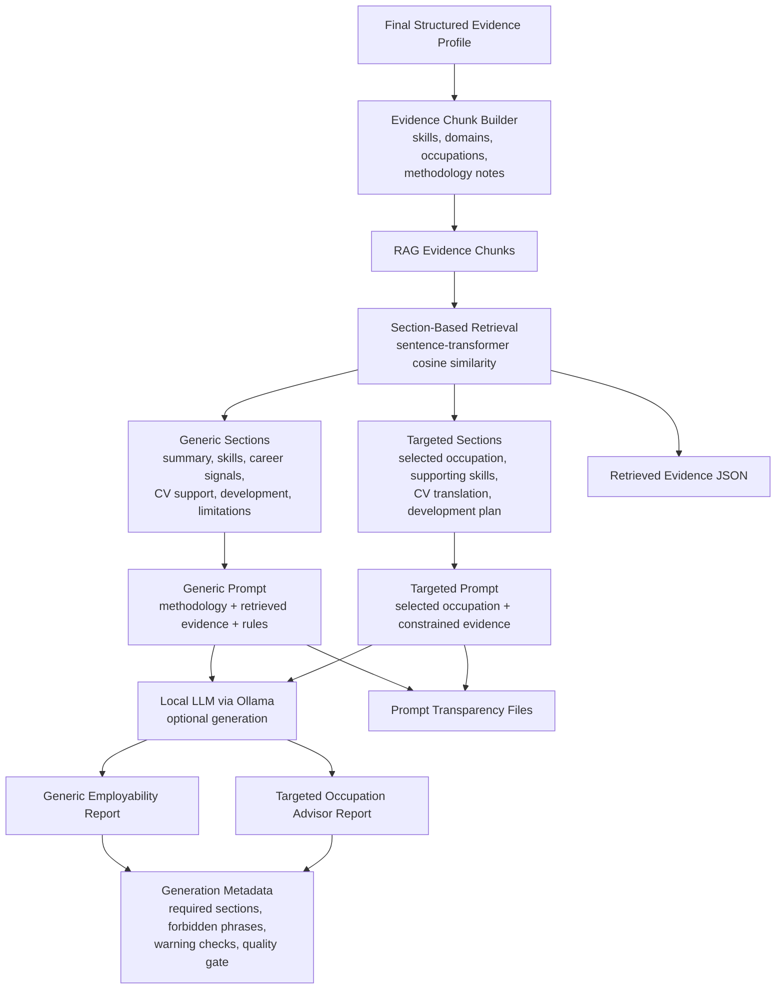
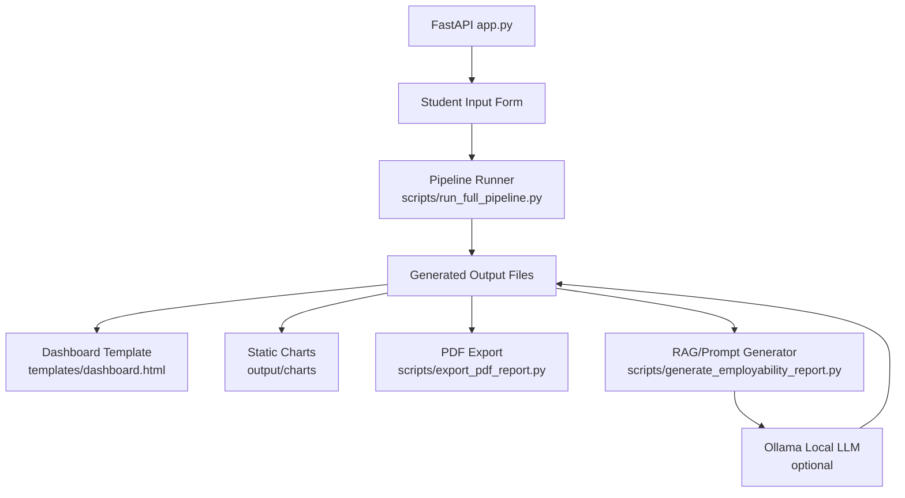

# System Architecture

This document describes the current system architecture for the explainable
academic evidence profiling prototype. The architecture is pipeline-oriented:
each stage produces transparent intermediate artifacts, and downstream
components consume the canonical final structured profile.

## 1. End-to-End Pipeline Architecture



### Interpretation

The pipeline is designed to avoid a black-box workflow. Each major inference
stage stores structured evidence and methodology metadata so that the dashboard,
RAG prompts and PDF export can explain how outputs were produced.

## 2. Evidence Model / XAI Architecture



### Interpretation

The final profile is not only a list of ranked skills. It is an evidence model
that preserves traceability from learning outcomes to Bloom, ESCO, scoring,
semantic domains and occupation-orientation signals.

The most important artifact is:

```text
output/final_student_competency_profile.json
```

## 3. RAG Architecture



### Interpretation

The RAG layer is controlled rather than fully autonomous. The system retrieves
specific evidence for predefined report sections and then asks the LLM to write
within strict evidence boundaries. This improves auditability and supports
responsible output framing.

This is structured runtime retrieval, not a persistent vector database
deployment. Evidence chunks are generated from the final profile for each run,
embedded and retrieved by report section. A vector database would become more
appropriate for a larger system with many profiles, larger document corpora,
uploaded CVs or dynamic user queries.

## 4. Runtime Components



### Interpretation

The dashboard is an orchestration and presentation layer. The evidence pipeline
itself is implemented as standalone Python scripts so that the project remains
auditable and reproducible outside the web interface.

## 5. Main Artifacts

| Artifact | Purpose |
| --- | --- |
| `data/student_input.json` | Student-selected modules and assessment data. |
| `data/modules_with_bloom.json` | Module learning outcomes enriched with Bloom evidence. |
| `output/modules_with_bloom_esco_filtered.json` | Bloom + ESCO skill matches after semantic filtering. |
| `output/student_skill_profile.json` | Raw student skill occurrence evidence. |
| `output/student_skill_profile_calibrated.json` | Aggregated and calibrated skill evidence. |
| `output/student_skill_clusters.json` | Semantic skill domains. |
| `output/student_occupation_orientation.json` | ESCO occupation-orientation signals. |
| `output/final_student_competency_profile.json` | Canonical structured evidence profile. |
| `output/rag_retrieved_evidence.json` | Retrieved evidence for generic RAG generation. |
| `output/targeted_rag_retrieved_evidence.json` | Retrieved evidence for selected occupation generation. |
| `output/rag_generation_metadata.json` | Generic generation quality metadata. |
| `output/targeted_rag_generation_metadata.json` | Targeted generation quality metadata. |
| `output/recruiter_ready_xai_report.pdf` | Final XAI/RAG PDF export. |

## 6. Design Rationale

The architecture prioritises:

- **Traceability:** outputs can be traced back to modules and learning outcomes.
- **Explainability:** scores expose their components and methodology assumptions.
- **Conservative interpretation:** outputs avoid claims of professional mastery.
- **RAG grounding:** LLM generation is constrained by retrieved structured evidence.
- **Local execution:** the prototype can run with a local Ollama model.
- **Modularity:** each stage can be inspected, rerun or replaced independently.

## 7. Architectural Limitations

- The pipeline is a research prototype, not a production deployment.
- ESCO and Bloom stages depend on text quality and semantic matching.
- Local LLM output still requires human review.
- The current pipeline is file-based and runtime-retrieval based rather than
  database-backed.
- Full expert validation is outside the current implementation scope.
